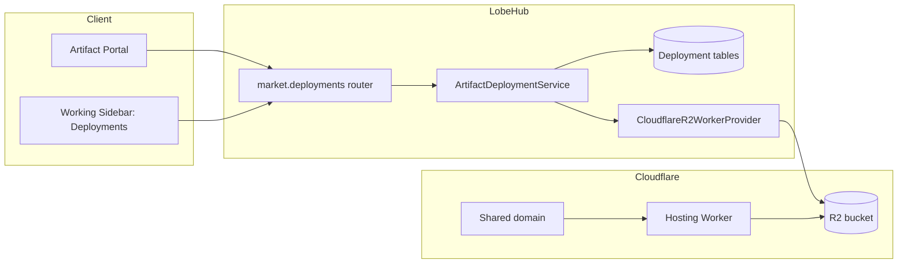
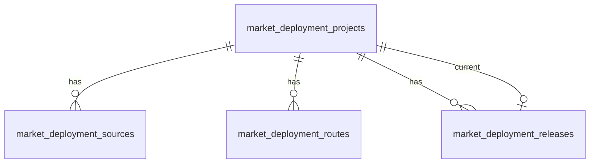
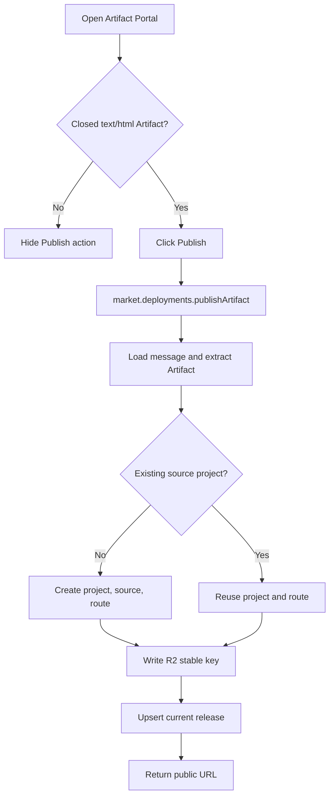
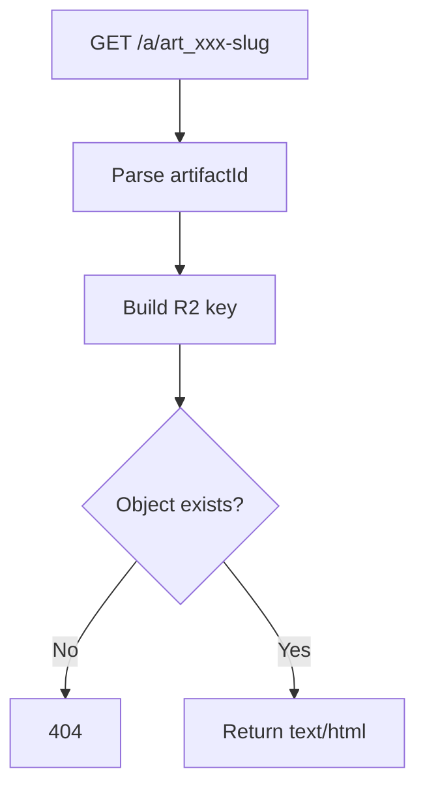

# Artifact Deployments — Design

**Date:** 2026-06-09
**Status:** Approved design, ready for implementation planning
**Scope:** Marketplace deployment APIs, HTML artifact publishing, Cloudflare R2 hosting, Agent topic deployment management

## Overview

Add a first-stage publishing path for completed HTML Artifacts. A user opens a generated `text/html` Artifact, clicks **Publish**, and receives a stable public URL under a shared deployment domain:

```text
https://artifacts.example.com/a/{artifactId}-{slug}
```

The first stage is not a general web-project deployment system. It is a static artifact hosting workflow:

1. LobeHub stores business metadata in Marketplace-owned deployment tables.
2. LobeHub writes the current HTML output into Cloudflare R2.
3. A preconfigured Cloudflare Hosting Worker serves the HTML from R2 by path.
4. The Agent topic Working Sidebar exposes a dedicated **Deployments** tab for management.

The model is intentionally broader than a single message attachment. Future project deployments may originate from an entire topic, several topics, a workspace, a repository, or a generated build artifact. The schema therefore models long-lived deployment projects, sources, routes, and releases separately.

## Decisions

| Area | Decision |
| --- | --- |
| First deployable type | Completed `text/html` Artifact only |
| Trigger | Explicit user action in the Artifact Portal |
| API ownership | Marketplace namespace: `lambdaClient.market.deployments.*` |
| Public route | Shared domain plus path: `/a/{artifactId}-{slug}` |
| Hosting substrate | Manually preconfigured Cloudflare Worker bound to R2 |
| Content storage | Cloudflare R2 |
| Metadata storage | LobeHub database |
| Versioning | Overwrite current release in POC; data model reserves release history |
| Management UI | Dedicated `Deployments` tab in the Agent topic Working Sidebar |
| Cloudflare infra creation | Out of scope for POC; resources are preconfigured |
| Workers for Platforms | Deferred; provider abstraction preserves migration path |

## Background

Artifact rendering is currently message-backed. The markdown pipeline transforms `<lobeArtifact>` tags into Artifact cards, and the Portal reads the active Artifact via `messageId + artifactIdentifier`. Relevant current files include:

| Area | Current files |
| --- | --- |
| Artifact card | `src/features/Conversation/Markdown/plugins/LobeArtifact/Render/index.tsx` |
| Artifact Portal title | `src/features/Portal/Artifacts/Title.tsx` |
| Artifact content extraction | `src/store/chat/slices/portal/selectors.ts` |
| Portal routing | `src/features/Portal/router.tsx` |
| Agent Working Sidebar | `src/routes/(main)/agent/features/Conversation/WorkingSidebar/index.tsx` |
| Marketplace router | `src/server/routers/lambda/market/index.ts` |

Cloudflare has two relevant deployment paths:

| Cloudflare path | Role in this design |
| --- | --- |
| Worker + R2 | POC hosting substrate for static HTML artifacts |
| Workers for Platforms | Future substrate for user/project Workers and more advanced routing |

The ordinary Worker path and Workers for Platforms path are compatible at the deployment artifact boundary, but differ in runtime routing. In the POC, a stable Hosting Worker reads from R2. In a later stage, the same Marketplace deployment API can dispatch to a Workers for Platforms provider.

References:

- [Cloudflare R2 Workers API](https://developers.cloudflare.com/r2/api/workers/workers-api-reference/)
- [Workers static assets direct upload](https://developers.cloudflare.com/workers/static-assets/direct-upload/)
- [Workers for Platforms overview](https://developers.cloudflare.com/cloudflare-for-platforms/workers-for-platforms/how-workers-for-platforms-works/)
- [Workers for Platforms static assets](https://developers.cloudflare.com/cloudflare-for-platforms/workers-for-platforms/configuration/static-assets/)

## Goals

- Publish a completed HTML Artifact to a public shared-domain URL.
- Keep the public URL stable across repeated publishes of the same Artifact.
- Store HTML content in R2 and business metadata in LobeHub database tables.
- Place the API under the Marketplace router namespace.
- Add a dedicated `Deployments` tab to the Agent topic Working Sidebar.
- Preserve a clean migration path to project deployments and Workers for Platforms.
- Avoid runtime dependency from the Hosting Worker to the LobeHub database.

## Non-Goals

- Creating Cloudflare R2 buckets, Workers, routes, custom domains, or dispatch namespaces at runtime.
- Publishing SVG, React, or arbitrary code artifacts.
- Building frontend projects.
- Creating an Agent tool that publishes automatically.
- Version history, rollback UI, preview environments, access control for private links, or analytics.
- Binding each HTML Artifact to its own Worker or custom domain.

## Architecture



The Hosting Worker is stable infrastructure. It should not change when a user publishes a new HTML Artifact. It only parses the public path, maps `artifactId` to a deterministic R2 key, reads the object, and returns an HTML response.

## Marketplace API

The deployment API belongs to the existing lambda Marketplace namespace, not the tool-execution market router.

| Concern | Design |
| --- | --- |
| Server router | `src/server/routers/lambda/market/deployment.ts` |
| Router mount | `marketRouter.deployments` in `src/server/routers/lambda/market/index.ts` |
| Client service | `src/services/marketDeployment.ts` |
| Procedure base | Authenticated procedure with `serverDatabase` and Marketplace user context where needed |
| Domain service | `src/server/services/market/deployment` called only from Marketplace router |

### API Surface

| API | Type | Purpose |
| --- | --- | --- |
| `market.deployments.publishArtifact` | mutation | Publish or overwrite the current HTML release for a message Artifact |
| `market.deployments.listByTopic` | query | List deployments associated with the active topic |
| `market.deployments.getById` | query | Fetch one deployment project and its current route/release |
| `market.deployments.unpublish` | mutation | Mark a route/project unpublished and optionally remove current R2 object |

`updateMetadata` is intentionally deferred. Renaming, route canonicalization, visibility, and dedicated host management belong to a later deployment-management phase.

### `publishArtifact`

The client submits a source pointer, not raw HTML. The server treats the persisted message content as canonical and extracts the matching Artifact server-side.

| Field | Type | Rule |
| --- | --- | --- |
| `topicId` | string | Must belong to the current user |
| `messageId` | string | Must belong to `topicId` and current user context |
| `artifactIdentifier` | string | Must resolve to a closed `<lobeArtifact>` block |
| `requestedSlug` | string, optional | Normalized; title-derived slug is used if absent |

The server extracts:

| Extracted field | Source |
| --- | --- |
| `title` | Artifact tag `title` attribute |
| `type` | Artifact tag `type` attribute; must be `text/html` |
| `html` | Artifact body |
| `contentHash` | SHA-256 of normalized HTML bytes |

Successful response:

| Field | Meaning |
| --- | --- |
| `projectId` | Long-lived deployment project ID |
| `routeId` | Public route ID |
| `releaseId` | Current release ID |
| `artifactId` | Stable public path key |
| `publicUrl` | Shared-domain URL |
| `status` | `published` |
| `updatedAt` | Last publish time |

### `listByTopic`

| Field | Type | Rule |
| --- | --- | --- |
| `topicId` | string | Required |
| `kind` | `htmlArtifact \| project`, optional | Defaults to all topic-visible deployments |

The POC returns only projects associated with the current topic by direct source or primary topic scope.

### `unpublish`

| Field | Type | Rule |
| --- | --- | --- |
| `projectId` | string | Must belong to current user |

The POC marks the project route as unpublished and deletes the deterministic current R2 object. It does not delete source records by default. Deleting the R2 object is required because the Hosting Worker does not query the LobeHub database.

## Data Model

The schema is split into four tables so that future engineering projects do not need to masquerade as message artifacts.



### `market_deployment_projects`

Long-lived publishable object.

| Field | Purpose |
| --- | --- |
| `id` | Project primary key |
| `userId` | Owner |
| `kind` | `htmlArtifact` in POC; future `webProject` |
| `scopeType` | `topic` in POC; future `multiTopic`, `workspace`, `repo` |
| `primaryTopicId` | Current topic for POC and topic-level listing |
| `title` | Display title |
| `status` | `active`, `unpublished`, `failed` |
| `currentReleaseId` | Current release pointer |
| `metadata` | Provider-neutral project metadata |
| `createdAt`, `updatedAt` | Audit timestamps |

### `market_deployment_sources`

Source references that explain where a project came from.

| Field | Purpose |
| --- | --- |
| `id` | Source primary key |
| `projectId` | Parent deployment project |
| `userId` | Denormalized owner for uniqueness and scoped lookups |
| `sourceType` | `messageArtifact` in POC; future `topic`, `multiTopic`, `document`, `repo`, `workspace` |
| `topicId` | Source topic when applicable |
| `messageId` | Source message when applicable |
| `artifactIdentifier` | Artifact identifier when applicable |
| `metadata` | Source-specific payload |
| `createdAt`, `updatedAt` | Audit timestamps |

POC uniqueness:

```text
unique(userId, sourceType, topicId, messageId, artifactIdentifier)
```

The service writes `sources.userId` from the parent project owner inside the same transaction that creates the project/source pair. Project ownership remains canonical on `market_deployment_projects.userId`; the denormalized source owner exists to make first-publish idempotency enforceable with a direct unique index.

### `market_deployment_routes`

Public route records. Routes are separate from projects so that later project deployments can add dedicated hosts or custom domains.

| Field | Purpose |
| --- | --- |
| `id` | Route primary key |
| `projectId` | Parent deployment project |
| `routeType` | `sharedPath` in POC; future `dedicatedHost`, `customDomain` |
| `artifactId` | Stable public route key, e.g. `art_xxx` |
| `slug` | Readable path suffix |
| `host` | Shared host, e.g. `artifacts.example.com` |
| `path` | Canonical public path, e.g. `/a/art_xxx-landing-page` |
| `status` | `published`, `unpublished` |
| `metadata` | Route provider metadata |
| `createdAt`, `updatedAt` | Audit timestamps |

The Hosting Worker only depends on `artifactId`. It ignores the slug for storage lookup.

### `market_deployment_releases`

Current output record. POC overwrites the current release content and stable R2 key; later version history can create multiple release rows per project.

| Field | Purpose |
| --- | --- |
| `id` | Release primary key |
| `projectId` | Parent deployment project |
| `status` | `published`, `failed` |
| `storageProvider` | `cloudflare-r2` |
| `storageKey` | R2 key |
| `contentHash` | SHA-256 of HTML |
| `size` | HTML byte size |
| `provider` | `cloudflare-r2-worker` |
| `providerMetadata` | Bucket, endpoint, future WfP namespace/version metadata |
| `error` | Failure detail for failed releases |
| `publishedAt`, `createdAt`, `updatedAt` | Audit timestamps |

POC storage key:

```text
html-artifacts/{artifactId}/index.html
```

Future versioned storage key:

```text
html-artifacts/{artifactId}/versions/{versionId}/index.html
```

## Publish Flow



The service must execute database writes and R2 writes in a failure-aware order:

1. Validate user, topic, message, and Artifact.
2. Create or resolve the project/source/route inside a database transaction.
3. Write the HTML to R2.
4. Upsert the current release and mark route/project as published.
5. Return the public URL only after the current release metadata is persisted.

If R2 succeeds and the final DB write fails, the API returns failure and records no public success. Orphan cleanup can be deferred because the deterministic key is overwritten on the next successful publish.

## Cloudflare Provider

### Runtime Configuration

| Environment variable | Purpose |
| --- | --- |
| `MARKET_DEPLOYMENT_PUBLIC_BASE_URL` | Shared public base URL, e.g. `https://artifacts.example.com` |
| `MARKET_DEPLOYMENT_R2_BUCKET` | R2 bucket name |
| `MARKET_DEPLOYMENT_R2_ACCOUNT_ID` | Cloudflare account ID for S3-compatible R2 writes |
| `MARKET_DEPLOYMENT_R2_ACCESS_KEY_ID` | R2 write access key |
| `MARKET_DEPLOYMENT_R2_SECRET_ACCESS_KEY` | R2 write secret |
| `MARKET_DEPLOYMENT_MAX_HTML_BYTES` | Maximum accepted HTML size; default `1048576` |

The Hosting Worker receives its own R2 binding through Cloudflare configuration. LobeHub does not pass database credentials or application secrets to the Worker.

### Provider Interface

| Method | POC behavior | Future behavior |
| --- | --- | --- |
| `publishRelease` | Write `text/html` to R2 stable key | Upload Worker assets or WfP user Worker bundle |
| `resolvePublicRoute` | Build shared path URL | Allocate dedicated host or custom domain |
| `deleteRelease` | Delete deterministic R2 object and mark unpublished | Remove route, asset version, or dispatch binding |
| `healthCheck` | Validate configured base URL and R2 write access | Validate dispatch namespace, route, and build substrate |

The Marketplace router must not call Cloudflare APIs directly. It calls a deployment service, which calls a provider adapter.

## Hosting Worker

The Hosting Worker is stable manually deployed infrastructure.



| Behavior | Rule |
| --- | --- |
| Path parsing | Accept `/a/{artifactId}-{slug}` |
| Storage lookup | `html-artifacts/{artifactId}/index.html` |
| Slug mismatch | POC returns content if `artifactId` exists |
| Headers | `Content-Type: text/html; charset=utf-8` |
| Missing object | `404` |
| Invalid path | `404` |

The Worker intentionally avoids database lookup. Canonical URL enforcement can be added later by writing route metadata into R2 sidecar objects or by introducing a lightweight metadata store, but it is not part of the POC.

## User Interface

### Artifact Portal

Add a Publish action in the Artifact Portal header.

| Condition | UI behavior |
| --- | --- |
| `type !== text/html` | Hide Publish action |
| Artifact tag not closed | Hide Publish action |
| Publish in progress | Disable action and show loading |
| Publish success | Show public URL with copy and open actions |
| Publish failure | Show precise error toast/message |

The action belongs in the Artifact Portal because publishing is an operation on the currently inspected Artifact.

### Agent Working Sidebar

Add a dedicated `Deployments` tab to the Agent topic Working Sidebar.

| Tab area | POC content |
| --- | --- |
| Summary | Published count and last publish time for the current topic |
| HTML Artifacts | Title, public URL, status, updated time, source message |
| Actions | Open, copy URL, unpublish |
| Empty state | No published deployments for this topic |

This tab is intentionally separate from `resources`. It will later host project deployments, build status, route management, and custom domain state.

## Permissions

| Operation | Authorization rule |
| --- | --- |
| Publish | Current user owns the topic/message source |
| List by topic | Current user owns the topic |
| Get by ID | Current user owns the deployment project |
| Unpublish | Current user owns the deployment project |
| Public read | Anyone with public URL can access HTML through the shared domain |

Published HTML is public by URL in the POC. Because user-authored HTML can execute scripts, the shared deployment domain must be isolated from the main application domain.

## Error Handling

| Scenario | API behavior | UI behavior |
| --- | --- | --- |
| Service not configured | `PRECONDITION_FAILED` with configuration message | Show "Deployment service is not configured" |
| Topic/message not owned | `FORBIDDEN` or `NOT_FOUND` | Show failure toast |
| Artifact missing | `BAD_REQUEST` | Keep Publish action available only after refresh if state changed |
| Artifact not closed | `BAD_REQUEST` | Hide action before request |
| Artifact not `text/html` | `BAD_REQUEST` | Hide action before request |
| HTML too large | `PAYLOAD_TOO_LARGE` | Show size-limit message |
| R2 write failure | `INTERNAL_SERVER_ERROR` with provider error category | Show retryable failure |
| DB write failure | `INTERNAL_SERVER_ERROR` | Do not show public URL as successful |

Failed releases may be recorded when a project already exists. A failed first publish should not create a visible published route.

## Testing

Tests must validate behavior, not internal constant snapshots.

| Layer | Test focus |
| --- | --- |
| Unit | Slug normalization, public path parsing, R2 key derivation, Artifact extraction, content hash |
| Service | Create-on-first-publish, overwrite-on-repeat-publish, R2 failure handling, DB failure handling |
| Router | Auth, topic ownership, input validation, Marketplace namespace shape |
| UI | Publish action visibility, publish success state, Deployments tab listing and empty state |
| Manual | With configured R2 and Hosting Worker, a published URL returns the expected HTML |

Targeted commands will be selected during implementation based on touched files, using focused Vitest runs and type checking.

## Acceptance Criteria

| ID | Criterion |
| --- | --- |
| AC1 | A completed `text/html` Artifact can be published from the Artifact Portal |
| AC2 | The returned URL uses `/a/{artifactId}-{slug}` under the configured shared base URL |
| AC3 | Republishing the same Artifact preserves the URL and overwrites the current R2 object |
| AC4 | `market.deployments.listByTopic` returns the current topic's deployments |
| AC5 | The Agent Working Sidebar has a `Deployments` tab showing published HTML Artifacts |
| AC6 | Non-HTML and incomplete Artifacts do not show the Publish action |
| AC7 | Missing Cloudflare/R2 configuration produces a clear error |
| AC8 | The schema can represent future project deployments without binding projects to a `messageId` |
| AC9 | The Hosting Worker serves HTML without querying LobeHub database |

## Future Extensions

| Extension | Supported by |
| --- | --- |
| Version history and rollback | Multiple release rows and versioned R2 keys |
| Project builds | `project.kind = webProject`, non-message sources, dedicated routes |
| Dedicated host/custom domain | Additional route types |
| Workers for Platforms | Additional provider adapter |
| Agent-triggered deployment | Reuse Marketplace deployment service behind a tool with human approval |
| Private/unlisted deployments | Route visibility fields plus access-gated Hosting Worker |
| Analytics | Route or release event table |
